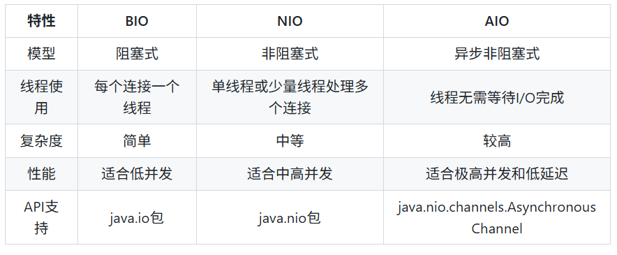

bio: 
概念：传统的java I/O模型，基于流进行数据的读写操作。
特点：同步阻塞，即当线程调用read或write方法时，线程会被阻塞，直到有数据可读或数据写入完成。
应用场景：适合处理较少并发连接的应用，传统的文件读取或者简单的服务器

nio：
概念：java1.4引入的非阻塞I/O模型，基于通道和缓冲区进行数据的读写操作。
特点： -非阻塞式：线程可以在等待io操作时处理其他的任务
        支持选择器，同时处理多个通道
        更高的性能和拓展性，适合高并发
应用场景：适合处理高并发连接的应用，如聊天室，实时数据传输等

aio：
概念：java7引入的异步I/O模型，允许io操作以异步方式进行，线程无需等待操作完成。
特点：完全异步：io操作完成后，通过回调机制通知exe
        更高的性能和拓展性，适合高并发
        复杂度较高，实现难度大于BIO和NIO。
应用场景：适用于需要极高性能和资源利用率的系统，如大型分布式系统和实时数据处理。

