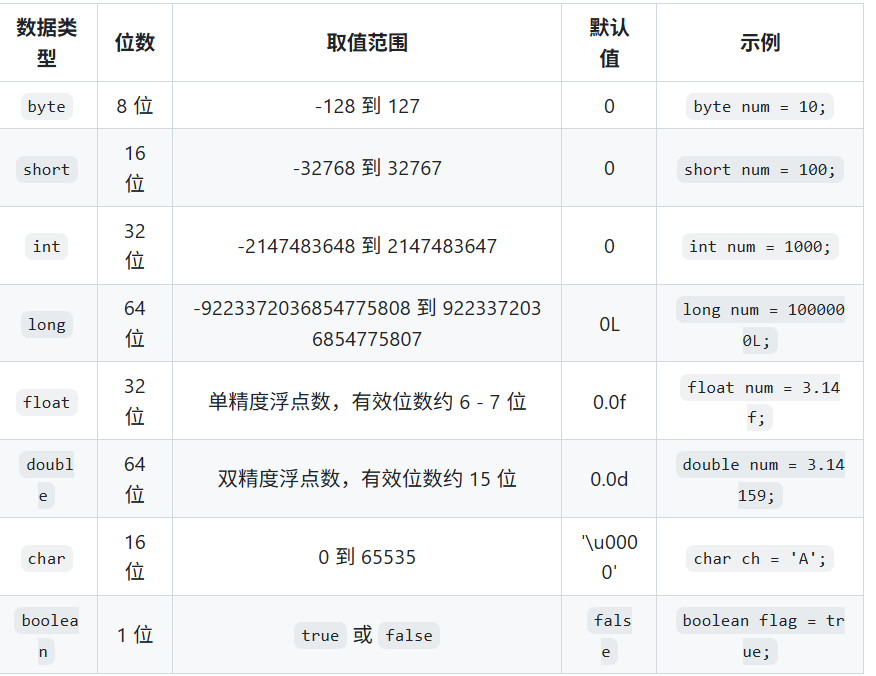
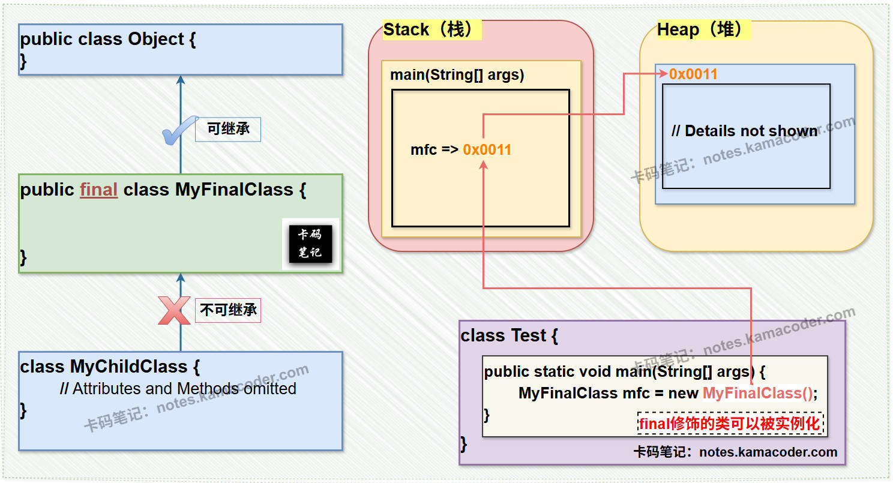
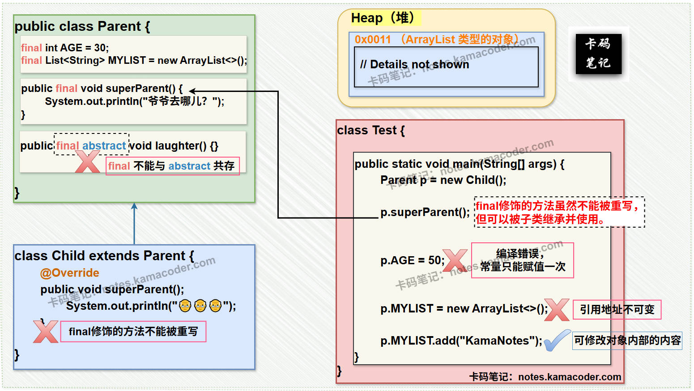

# 1.java中的数据类型有哪些？分为那两大类？

###   就是分为基本数据类型和引用数据类型

#### 基本数据类型：
整数型：**byte,short,int,long**,
浮点型：**float,double**
字符型：**char**,
布尔型：**boolean**

#### 引用数据类型:
类class,接口interface,数组

拓展图，取值范围，默认值

# 2.java中的final关键字可以修饰什么，修饰了之后有什么特点：

### 可以来修饰**类，方法，变量**，不能修饰**构造器**

**修饰类：该类不能被**继承****

修饰方法：该方法不能被**重写**

修饰变量：该变量不能被**重新赋值**，但是可以改变引用对象的属性值

# 3.自动装箱于拆箱机制

自动装箱：编译器自动将基本数据类型转换成对应的包装类型
自动拆箱：编译器自动将包装类型转换成对应的基本数据类型

# 4.java的访问修饰符有哪些？

public，公共
protected，受保护
default，默认
private，私有

# 5.java中静态变量和非静态的区别？

存储在方法区的静态存储区，在类加载时分配内存
全局共享，所有对象实例共享和静态方法
可以通过**类名.变量名**访问

非静态
存储在堆内存中
随实例创建，随实例销毁
必须通过实例对象访问

# 6.**经典问题重载和重写**

重载：
是在同一个类当中，方法名相同，但是参数不同

重写：
是子类重新实现父类方法

# 7.== 和 equals（）的区别

== ：判断两个对象是否相等
equals()：默认情况下没啥区别，但是很多类重写了这个方法，判断两个对象的**内容**是否相等

# 8.**java异常处理机制**

将可能抛出异常的代码放在**try**中，try中可能抛出的异常用**catch**处理
可在最后加一个**finally**来执行清理代码
在方法签名中使用**throw**关键字抛出异常

# 9.**java的泛型**
让你在定义类、接口或方法时，使用一个或多个类型占位符（如 <T>、<K, V>），然后在使用时才指定具体的类型。
            泛型可以提供类型安全，避免类型转换，提高代码复用性。

核心目的：
类型安全：编译器在编译时就能检查类型是否正确，避免运行时 ClassCastException。
消除强制类型转换：使用泛型后，从集合或类中取出元素时，不再需要手动进行类型转换。
代码复用： 写一套代码就能处理多种数据类型，提高代码通用性。

泛型类，泛型方法，泛型接口，泛型通配符，泛型上下限
其实就可以理解为一个模板，**在不确定作用的对象的类型时使用**
比如一个方法，传入的参数类型不确定，那么就可以使用泛型

但是不能用于静态变量，静态方法、
静态方法的变量使用了泛型，那么这个静态方法可以使用泛型

作用：类型安全，避免了强转，代码复用

泛型类：class ClassName<T>
泛型方法：public <T> void methodName(T t)
泛型接口：interface InterfaceName<T>

可以指定**上边界**，意思是泛型只能是**某个类或者接口的子类**

如下所示：它继承了number那么它只能是number或者number的子类
-------------------------------------------------------------------------------------------------------------------------------------------------------------------------------------------------------------------------------------------------------------------------------------------------------------------------------------------------------------
public class BoundedTypeExample {
public static <T extends Number> void printNumbers(T[] numbers) {
for (T num : numbers) {
System.out.println(num);
}
}

    public static void main(String[] args) {
        Integer[] intArray = {1, 2, 3};
        Double[] doubleArray = {1.1, 2.2, 3.3};

        printNumbers(intArray);  // 适用于 Integer 类型
        printNumbers(doubleArray);  // 适用于 Double 类型
    }
}

------------------------------------------------------------------------------------------------------------------------------------------------------------------------------------------------------------------------------------------------------------------------------------------------------------------------------------------------------

泛型通配符：
**可以理解为是在使用泛型时使用通配符**
？：表示任意类型
？ extends T：表示T的子类
？ super T：表示T的父类

如下示例 ： 其实就表示接受任何number或者number的子类
-------------------------------------------------------------------------------------------------------------------------------------------------------------------------------------------------------------------------------------------------------------------------------------------------------------------------------------------------------------
public class WildcardExample {
public static void printList(List<? extends Number> list) {
for (Number num : list) {
System.out.println(num);
}
}

    public static void main(String[] args) {
        List<Integer> intList = List.of(1, 2, 3);
        List<Double> doubleList = List.of(1.1, 2.2, 3.3);

        printList(intList);  // 适用于 Integer 类型
        printList(doubleList);  // 适用于 Double 类型
    }
}

--------------------------------------------------------------------------------------------------------------------------------------------------------------------------------------------------------------------------------------------------------------------------------

问答

10.**String为什么不可变？**
自我理解：
首先可以查看string类的源码：

-------------------------------------------------------------------------------------------------------------------------------------------------------------------------------------------------------------------------------------------------------------------------------------------------------------------------------------
`public final class String
implements java.io.Serializable, Comparable, CharSequence {
/** 存储字符串内容的字符数组 */
private final char value[];

    /** 缓存字符串的hash code */
    private int hash; // Default to 0
    
    // ...其他代码
}
`
-------------------------------------------------------------------------------------------------------------------------------------------------------------------------------------------------------------------------------------------------------------------------------------------------------------------------------------
可以看到Sting类本身就是final的，那么它就不能被继承，
它里面的属性value也是final定义的所以不能被修改，同时没有提供任何修改value值的方法，所以String是不可变的

好处：
1.**线程安全**，因为不可变的对象在多线程下是安全的
2.**安全性**，string类型随处可见，如果用于存储**敏感信息**，那么一旦被修改，就会导致数据安全漏洞
3.**缓存hashcode**，因为string是final型的可以缓存自己的哈希值
4.**字符串常量池优化**，因为不可变，所以可以在多个共享中引用

**11.String、StringBuffer与StringBuilder的区别**
string:不可变的字符序列
不可变，线程安全，内存效率问题（不可改变，导致字符串值会被多次复制，频繁操作造成内存浪费）
使用场景：不需频繁改变，较小的字符串处理操作

stringbuffer：
可变更，并且线程安全
可变性，线程安全，性能（相对较低，尤其是不涉及多线程时）
使用场景：多线程操作字符串，频繁修改字符串

stringbuild：
可变更，线程不安全
可变性，线程不安全，性能（最高，不涉及多线程时）
使用场景：单线程操作字符串，频繁修改字符串

12.**java的lambda表达式**
lambda表达式可以理解为一种匿名函数
没有名称，但是它有参数列表、函数主体、返回类型，以及一个可选的抛出异常声明

示例：
我写一个add方法：
`public int add(int a,int b){
return a+b;
}
`
那么我使用lambda表达式可以写成：
`(int a,int b)->{return a+b;}`

// 使用Lambda表达式来写
`BinaryOperator<Integer> add = (a, b) -> a + b;`

示例：
`List<String> names = Arrays.asList("Alice", "Bob", "Charlie");
names.stream()
.filter(name -> name.startsWith("A")) // 用Lambda表达式过滤
.forEach(System.out::println); // 输出符合条件的元素`

13.java Optional类极其必要性：
 
将**可能为null的值**封装成**Optional对象**，例如（optional<String>）
然后调用方法（**isPresent(),orElse()**）显式的表达“可能是null”的逻辑

作用：
**避免空指针异常**（NullPointException）：必须处理空值，避免运行时错误
代码简洁
**api设计更合理**，可以避免空指针异常，提高代码的健壮性

14.**java8的新特性**
1.**Lambda表达式**：简化了匿名内部类的写法，使代码更加简洁
`List<String> list = Arrays.asList("apple", "banana", "cherry");
list.forEach(s -> System.out.println(s));  // 使用Lambda表达式简化代码`

2.**Stream API**：提供了一种处理集合元素的方式，支持声明式进行数据操作，如过滤、映射、排序、聚合等
`List<String> list = Arrays.asList("apple", "banana", "cherry");
long count = list.stream()
.filter(s -> s.startsWith("a"))
.count();`

3.**Optional类**：用于处理可能为null的值，避免空指针异常
`Optional<String> optional = Optional.ofNullable("Hello");
optional.ifPresent(s -> System.out.println(s));  // 如果值存在，打印
`

4，**新的日期api**：引入了java.time (LocalDate, LocalTime, LocalDateTime等)
解决老版本存在的线程不安全、复杂性问题
`LocalDate date = LocalDate.of(2023, 10, 1);
LocalDate today = LocalDate.now();`

5.**函数式接口**：定义了只有一个抽象方法的接口，可以作为参数传递给Lambda表达式
`@FunctionalInterface
interface MyFunction {
void apply();
}`

6.**默认方法**：允许在接口中定义实现，使得接口的实现类不需要实现这些方法
`interface MyInterface {
default void show() {
System.out.println("Default method");
}
}

class MyClass implements MyInterface {
// 无需实现show方法
}`

