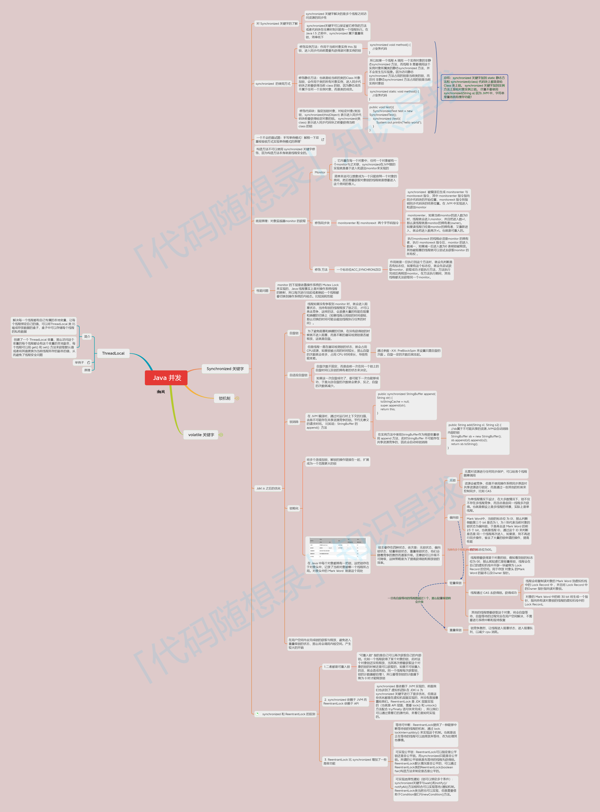

总览：

#  1.java创建线程有几种方式

1.继承Thread类
继承thread重写run方法，来实现线程任务

`class MyThread extends Thread{
public void run(){
sout("hello world");
}
}

MyThread myThread = new MyThread();
myThread.start();`

2.实现Runnable接口
实现runnable接口，重写run方法，实现线程任务

`class  MyRunnable implements Runnable{
public void run(){
sout("hello world");
}
}

MyRunnable myRunnable = new MyRunnable();
Thread thread = new Thread(myRunnable);
thread.start();
`

3.使用线程池：使用Executor框架
Executor框架是java并发编程中的高级工具

通过Executor将任务交给线程池执行，

import java.util.concurrent.Executor;
import java.util.concurrent.Executors;

class MyTask implements Runnable{
public void run(){
sout("hello world");
}
}

//创建线程池并提交任务
Executor executor = Executors.newFixedThreadPool(10);
executor.execute(new MyTask());

4.使用Callable和Future接口来实现：
创建一个实现Callable接口的类，实现call方法。
然后使用ExecutorService来管理线程池，提交callable任务获取Future对象
Future对象可以获取线程执行的结果

# 2.线程的生命周期

1.新建（new）
被创建但是没有启动。   也就是：new Thread();

2.就绪（runnable）
线程已经被启动，但是还没有开始执行。   也就是：start();

3.运行（running）
线程正在执行  也就是run();

4.阻塞(Blocked)
线程阻塞，等待某个条件满足。  也就是：synchronized(lock){}

5.等待（waiting）
线程进入等待状态，等待其他线程唤醒。  也就是：object.wait(),Thread.join()

6.超时等待（timed waiting）
线程等待一段时间，当时间到达或者其他条件满足时，线程继续执行。 
也就是：Thread.sleep()，object.wait(timeout)

7.终止（Terminated）
线程run()执行完成或者因异常退出后，进入终止状态。一个终止的线程不在进入任何状态

# 3,什么事java中的并发和并行？它们的区别？
并发：一个cpu核心，来回处理多个线程，cpu调度处理这多个线程
并行：多个cpu核心，同时处理多个线程

# 4，线程和进程的区别？
简单理解，线程就是轻量级的进程，一个进程划分为多个线程，线程时cpu调度的基本单位
资源共享，切换开销小

进程：是资源分配的基本单位，相互隔离，切换开销大

# 5.start和run的区别？

start：启动线程，调用start()方法，线程进入就绪状态，等待cpu调度执行
run：如果直接调用就是一个普通的方法
线程任务，调用run()方法，线程进入运行状态，执行线程任务

# 6.java中的synchronized关键字是如何工作的？它有哪些使用场景？（synchronized关键字的原理和使用场景）
synchronized工作机制：
    1.锁机制： 当一个线程进入被synchronized修饰的方法或者代码块时
                会获得到对象锁。如果另一个线程进入到同步区域，该线程将会被堵塞
                直到拥有锁的线程释放锁。
    2.互斥性： synchronized保证了同一时刻只有一个线程可以访问被修饰的代码块或者方法
                从而保持数据的一致性
    3.内存可见性： 当一个线程修改了共享变量后，其他线程可以看到更新的值  

# 7.解释一下volatile关键字的作用和使用场景。（考点：volatile关键字的内存可见性和使用场景）

例如几个人在一起做项目，有一个公共的白板（主内存），
但为了快点干活，每人有自己的纸（线程自己的缓存），自己写的东西会放在自己的纸上，

没有volatile的话，那么每人在纸上写的东西，其他线程看不到，其他线程只能看到自己纸上的东西，
也就是没有及时的更新到白板上也就是主内存中

volatile做了什么：
如果你们约定某个信息很重要，那么写在白板上是要用特别显眼的红笔（这就是volatile）
其他人看到红笔的信息，就会立刻去白板上查看，而不是在自己的纸上查看

所以所：volatile主要保证了一件事：一个线程修改了变量，其他线程能够立即看到这个修改
            这就是线程可见性

