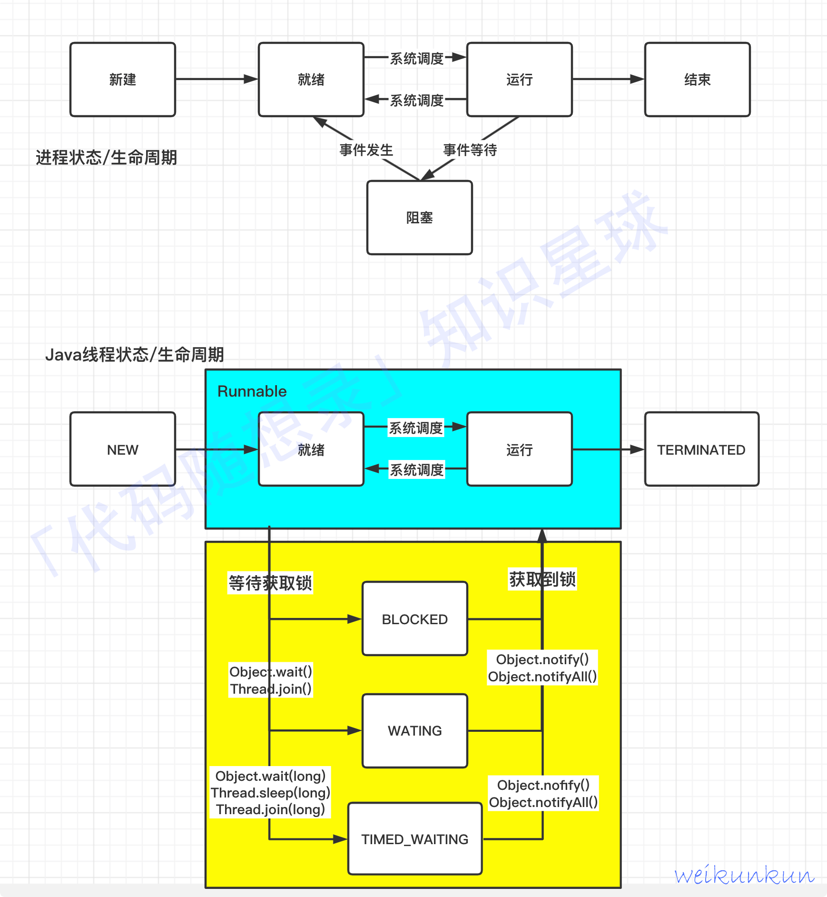

总览：

#  1.java创建线程有几种方式

1.继承Thread类
继承thread重写run方法，来实现线程任务

`class MyThread extends Thread{
public void run(){
sout("hello world");
}
}

MyThread myThread = new MyThread();
myThread.start();`

2.实现Runnable接口
实现runnable接口，重写run方法，实现线程任务

`class  MyRunnable implements Runnable{
public void run(){
sout("hello world");
}
}

MyRunnable myRunnable = new MyRunnable();
Thread thread = new Thread(myRunnable);
thread.start();
`

3.使用线程池：使用Executor框架
Executor框架是java并发编程中的高级工具

通过Executor将任务交给线程池执行，

import java.util.concurrent.Executor;
import java.util.concurrent.Executors;

class MyTask implements Runnable{
public void run(){
sout("hello world");
}
}

//创建线程池并提交任务
Executor executor = Executors.newFixedThreadPool(10);
executor.execute(new MyTask());

4.使用Callable和Future接口来实现：
创建一个实现Callable接口的类，实现call方法。
然后使用ExecutorService来管理线程池，提交callable任务获取Future对象
Future对象可以获取线程执行的结果

# 2.线程的生命周期

1.新建（new）
被创建但是没有启动。   也就是：new Thread();

2.就绪（runnable）
线程已经被启动，但是还没有开始执行。   也就是：start();

3.运行（running）
线程正在执行  也就是run();

4.阻塞(Blocked)
线程阻塞，等待某个条件满足。  也就是：synchronized(lock){}

5.等待（waiting）
线程进入等待状态，等待其他线程唤醒。  也就是：object.wait(),Thread.join()

6.超时等待（timed waiting）
线程等待一段时间，当时间到达或者其他条件满足时，线程继续执行。 
也就是：Thread.sleep()，object.wait(timeout)

7.终止（Terminated）
线程run()执行完成或者因异常退出后，进入终止状态。一个终止的线程不在进入任何状态

# 3,什么事java中的并发和并行？它们的区别？
并发：一个cpu核心，来回处理多个线程，cpu调度处理这多个线程
并行：多个cpu核心，同时处理多个线程

# 4，线程和进程的区别？
简单理解，线程就是轻量级的进程，一个进程划分为多个线程，线程时cpu调度的基本单位
资源共享，切换开销小

进程：是资源分配的基本单位，相互隔离，切换开销大

# 5.start和run的区别？

start：启动线程，调用start()方法，线程进入就绪状态，等待cpu调度执行
run：如果直接调用就是一个普通的方法
线程任务，调用run()方法，线程进入运行状态，执行线程任务

# 6.java中的synchronized关键字是如何工作的？它有哪些使用场景？（synchronized关键字的原理和使用场景）
synchronized工作机制：

加入线程获取锁：
monitor.enter()

解锁：
monitor.exit()

    1.锁机制： 当一个线程进入被synchronized修饰的方法或者代码块时
                会获得到对象锁。如果另一个线程进入到同步区域，该线程将会被堵塞
                直到拥有锁的线程释放锁。
    2.互斥性： synchronized保证了同一时刻只有一个线程可以访问被修饰的代码块或者方法
                从而保持数据的一致性
    3.内存可见性： 当一个线程修改了共享变量后，其他线程可以看到更新的值  

# 7.解释一下volatile关键字的作用和使用场景。（考点：volatile关键字的内存可见性和使用场景）

例如几个人在一起做项目，有一个公共的白板（主内存），
但为了快点干活，每人有自己的纸（线程自己的缓存），自己写的东西会放在自己的纸上，

没有volatile的话，那么每人在纸上写的东西，其他线程看不到，其他线程只能看到自己纸上的东西，
也就是没有及时的更新到白板上也就是主内存中

volatile做了什么：
如果你们约定某个信息很重要，那么写在白板上是要用特别显眼的红笔（这就是volatile）
其他人看到红笔的信息，就会立刻去白板上查看，而不是在自己的纸上查看

所以说：**volatile主要保证了一件事：一个线程修改了变量，其他线程能够立即看到这个修改**
            这就是线程可见性

使用场景：
开关状态：比如一个线程控制一个循环是否继续跑
1. 线程开关：
volatile boolean flag = true;

void stopThread(){
flag = false;
}

void doWork(){
while(flag){
//do something
}
}

volatile不能做什么：
volatile不能保证原子性，不能保证线程安全，不能保证有序性
    例如：count++；
1.读取count值，2.进行加一3.把新值写回count

这时如果多个线程同时对一个volatile的count做count++，
它们可能同时读取到旧值，然后进行加一，然后写回count，就会导致数据错误

这种复杂操作就需要用synchronized又或者AtomicInteger

**简单说，volatile 就是一个“喇叭”，一个线程改了值，
它会确保其他线程能“听见”（看见）最新的值。但它不管多个线程同时改的秩序问题。**

# 8.volatile和synchronized的区别？（考点：锁类型比较）

volatile只是用来修饰变量
synchronized可以修饰代码块或者方法，本质上就是给这段代码上锁，要想执行，必须先获得锁

由于指令的执行顺序是不可预知的，可能出现指令重排问题
volatile可以避免指令重排
synchronized是一种同步机制，可以保证线程安全

volatile能保证数据的一个可见性，但不能保证数据的原子性；
synchronized可以保证数据原子性，也可以保证数据可见性，但效率低

# **9.你知道Java中有哪些锁吗？（如synchronized, ReentrantLock等）**
# **，并比较它们的性能差异。（考点：锁机制，锁类型比较）**

synchronized（关键字，jvm进行实现）
    特征：可重入，自动释放，非公平锁
    优势：代码简洁，低竞争时性能好

ReentrantLock（java类，juc包，基于AQS实现）
    特征：可重入，手动释放，可公平锁
    优势：高竞争场景（非公平模式）性能略优

ReadWriteLock（如ReentrantReadWriteLock）
    特征：读锁可以共享，写锁互斥
    优势：读操作并发高，写操作互斥保持数据一致

StampedLock（jdk8+，优化读写锁）
    特征：支持乐观锁（无锁读取，验证本号，冲突时降级为读锁）
，三种模式（读，写，乐观锁）
    优势：乐观锁性能远高于读写锁（无锁竞争），适合用于极低写频率场景（如统计系统）

【公平锁/非公平锁】
公平锁： 线程按申请锁的顺序获取锁，先请求的线程先获得，保证公平，避免线程饥饿
非公平锁： 线程可以插队获取锁，吞吐量更高但可能导致饥饿

# 10.说说你对synchronized的理解

synchronized是java中的关键字，主要用来保证多线程并发访问共享资源时的线程安全

基本作用：其实就是当改方法或者说代码块被synchronized修饰时，
            就将其变成一个临界区，同一时刻只有一个线程能够进行一个访问
            其他线程需要等待，直到锁被释放

使用方式：应用于代码块或者方法吧，就是给这个区域进行一个上锁，
            当线程进入这个区域时，就会获得锁，其他线程进入这个区域时，就会堵塞

修饰实例方法时：锁对象就是当前实例；
修饰静态方法时：锁对象就是当前类的Class对象；
修饰代码块时：锁对象可以是任意对象

# 锁优化

因为synchronized依赖于软件层面上的jvm，因此它的性能会随着java版本的升级而提高

jvm对于synchronized的优化：

1.锁粗化： 将多个连续的锁操作合并为一个，减少锁的获取和释放次数
2.锁消除： 判断一段代码中不存在共享数据，则可以消除锁

无锁
3.偏向锁： 在无竞争的情况下，偏向第一个获取锁的线程，减少锁的开销
4.轻量级锁：竞争不激烈的情况，使用CAS算法（自旋模式）实现
5.重量级锁：在竞争很激烈时，升级为重量级锁，线程进入阻塞状态，等待锁的释放

# 11，什么是线程安全？如何确保线程安全？ （线程安全概念和方法）

问题：多个线程访问同一个数据，导致数据不一致

java采用同步机制来解决线程安全问题。

**同步机制：锁**，任何线程想要访问这段代码都需要先获得锁。

常用线程安全类：
            concurrent包中的类： ConcurrentHashMap，CopyOnWriteArrayList等
            Atomic包中的类： AtomicInteger，AtomicLong等

#  **AQS**

一个用来构建锁和同步器的框架，许多的经典的同步器都是基于aqs构建出来的
譬如CountDownLatch，Semaphored；

核心思想：
通过一个volatile修饰的int（共享变量）来表示同步状态
然后用cas对它同步状态进行修改，从而保证线程安全

如果被请求的共享资源空闲，就将当前的线程设置为有效的工作线程，并且将同步状态加1
（设为1的原因是，多个线程可以同时获取锁）

