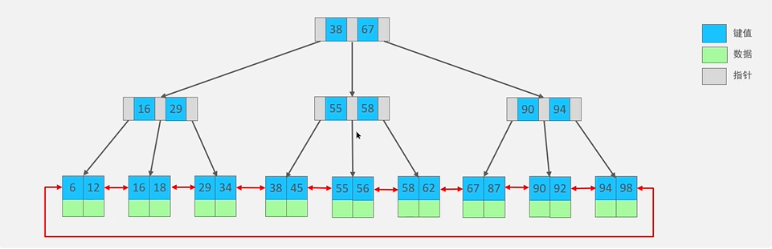

# 索引的创建
create index 索引名 on 表命

删除：
drop index 索引名 on 表名

# 索引类别

按[数据结构]： B+tree索引 、 Hash索引 、 Full-text索引
按[物理存储]; 聚簇索引（主键索引） 、 二级索引（辅助索引）
按[字段特性]； 主键索引 、 唯一索引 、 普通索引 、 前缀索引
按[字段个数]： 单列索引 、 联合索引

# 什么时候需要索引？
频繁查询
大表
唯一性要求
连接表的外键列
频繁使用排序和分组的列

# 啥时候不需要呢？
小表
经常更新
很少进行查询
大量重复数据

# 索引优化

前缀索引优化：使某字段的前几个字符简历索引，从而减小索引字段的大小

覆盖索引优化：从二级索引中可以查询得到记录，避免回表

主键索引设置为自增

避免过多的索引

# 什么使索引？ 为什么使用？
类似于书籍目录，可以帮助数据快速的对表中的数据进行定位

优点：
提高查询效率
创建唯一性索引，保证数据的唯一性
优化连接操作

# 为啥mysql使用b+树来作为索引？

读写待机低：
    只有非叶子结点进行存放指针，叶子结点用来UN放数据，磁盘存储压力小

查找效率稳定：
    每条数据所需的查找经过结点次数差不多

便于扫库和区间查询：
    它的叶子结点是一个双向链表

# 说一下索引失效的场景？

使用左或者左右模糊匹配：like‘%abc%’

在索引列使用函数或者表达式

数据分布不均

