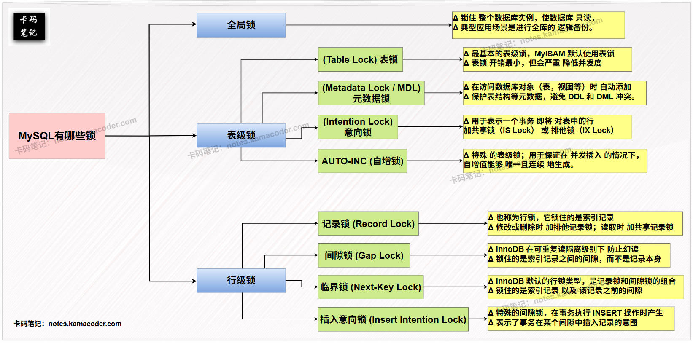

# 什么事数据库中的锁？有哪些类型？
    全局锁：锁住整个数据库实例，可以使整个数据库只读
    表级锁：锁住整个表
             表锁：基本的表锁，MyISAM存储引擎默认使用
             元数据锁：保护表结构等元数据，避免DDL和DMl
             意向锁：表明事务即将给行加锁
             
    行级锁：锁住一行数据（开销大，并发度高，innodb中实现了行级锁）
             Record Lock：锁住单条索引记录
             Gap Lock：锁住索引间的间隙，防止幻读
             
    

    

# 锁等待？死锁？如何处理？

锁等待：锁等待是指一个事务正在等待获取锁，但是锁已经被其他事务占用，导致等待。
死锁：死锁是指两个或多个事务互相等待对方释放锁，导致无法继续执行。

处理方法：死锁检测：mysql会自动检测死锁并回滚其中一个事务来打破死锁
        -死锁预防：合理设计失误的执行顺序

# 解释一下数据库的隔离级别与锁的关系？

隔离级别：
    读未提交：允许读取未提交的数据，会出现脏读、不可重复读、幻读
    读已提交：只允许读取已经提交的数据，会出现不可重复读、幻读
    可重复读：保证在一个事务内多次读取的数据是相同的，会出现幻读
    串行化：保证失误的串行执行，出现死锁

脏读：读到未提交的数据
不可重复读：先后两次获取同一记录的数据不一样
幻读：针对记录的集合，先后读取同一集合的数据，结果不一样

# 解释一下数据库的悲观锁和乐观锁？

悲观锁：
        概念：假设并发操作时经常会发生冲突，所以在一开始就对数据进行锁定
        使用场景：高并发且冲突频繁的环境（银行转账系统）
        实现方式：select ... for update

乐观锁：
        概念：假设数据并不会发生冲突，所以不加锁。
        而是在数据更新时检查是否有其他事务修改过数据，如果有冲突则回滚或重试

        使用场景：低并发或冲突少的环境
        实现方式：使用版本号（version字段）或时间戳，在更新时进行检查

