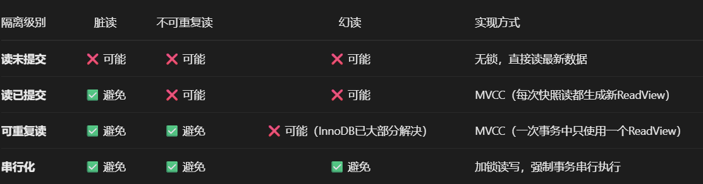
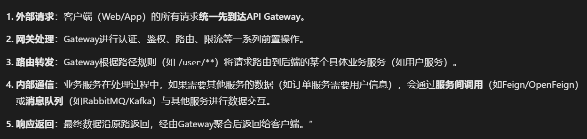
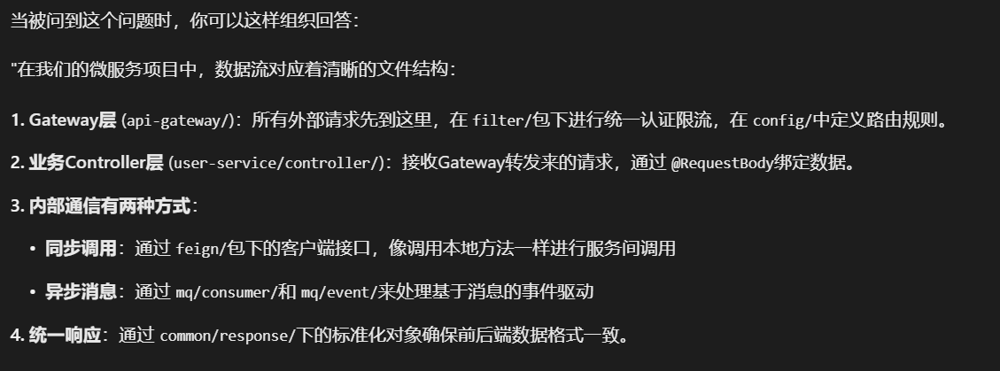
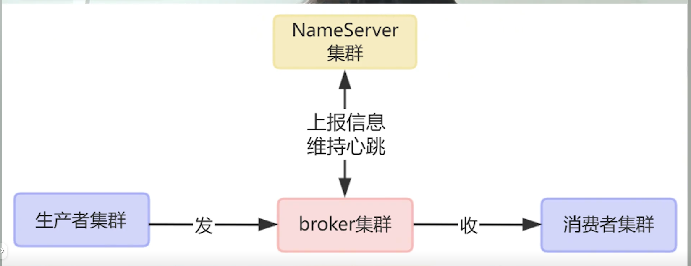
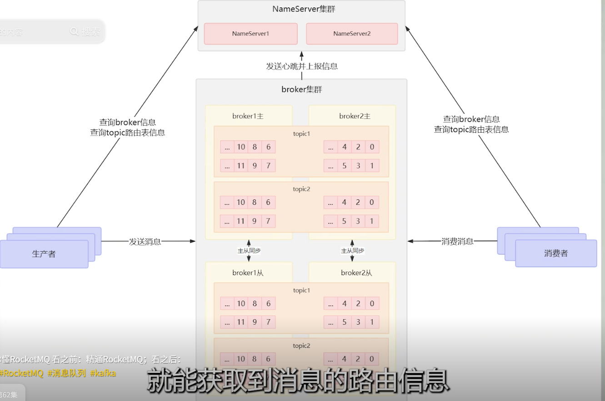

# 熟悉Java核心知识，熟悉常用集合及其数据结构，面向对象等
## 集合：
hashmap：
hashmap就是基于键值对来进行存储的一个数组，存储数据采用哈希表的结构 
当链表长度超过8，当链表长度小于6时转为链表；
数组长度超过64会转换为红黑树来进行存储
hashmap是线程不安全的，多线程情况下，容易出现死循环，导致cpu占用率飙升

扩容： 
触发条件就是键值对超过阈值    
一般阈值是容量乘以负载因子（0.75）这是一个在时间和空间成本上的折衷。                 
目的：
减少哈希冲突：
通过扩大数组容量，使得更加均匀的分布，减少哈希冲突，保证查询效率
保持性能：
不扩容的话，链表和红黑树越来越大，性能会下降

hashset：
基于hashmap来进行实现，存储不重复的键值对，底层是HashMap，
所以存储元素是键，值的话是固定的object

HashMap 的工作原理是什么？
基于哈希表，通过 Key 的 hashCode()计算数组下标存储和获取数据，使用链表和红黑树解决哈希冲突。
JDK 1.8 中 HashMap 做了什么优化？
引入了红黑树，当链表长度超过 8 且数组长度大于等于 64 时，将链表转为红黑树，防止查询性能退化。
HashMap 的扩容机制是怎样的？
当元素数量超过 容量 * 负载因子时，容量变为原来的 2 倍。JDK 1.8 优化了重新计算元素新位置的过程。
为什么 HashMap 的长度是 2 的幂次方？
为了高效计算数组下标。通过 (n-1) & hash代替 hash % n，位运算效率远高于取模运算。同时，这个设计也是 JDK 1.8 高效扩容算法的基础。
HashMap 是线程安全的吗？怎么解决？
不是。使用 ConcurrentHashMap。
HashMap 和 Hashtable 的区别？
HashMap 线程不安全，允许 null 键/值；
    Hashtable 线程安全（方法用 synchronized 修饰），不允许 null 键/值。Hashtable 已过时。

**“HashMap和ConcurrentHashMap的核心区别在于线程安全性。**
HashMap是非线程安全的，它在多线程环境下使用时可能会导致数据错乱或被破坏。
而ConcurrentHashMap是线程安全的，它专门为高并发场景设计，允许多个线程同时安全地进行读写操作。
为了实现这种高效的线程安全，它们的底层实现完全不同：
在JDK 8之后，
    ConcurrentHashMap采用了 CAS指令和**synchronized只锁住单个桶（链表头节点/树根）**的精细锁机制，
        极大降低了锁的粒度，保证了高并发下的性能。

相比之下，老的线程安全容器如Hashtable是**直接用synchronized锁住整个对象**，性能非常差。
此外，HashMap允许存储Null键和Null值，
        而ConcurrentHashMap出于并发安全的设计考量，不允许存储任何Null键或Null值。
总结一下就是：在单线程或不需要考虑并发的场景下，用HashMap性能最好；但在多线程并发环境中，
            ConcurrentHashMap是既安全又高性能的最佳选择。

## 数据结构：
#### 基本数据类型：
整数型：**byte,short,int,long**,
浮点型：**float,double**
字符型：**char**,
布尔型：**boolean**

#### int和integer的区别：
在 Java 中，int是基本数据类型（存储数值本身），而Integer是int对应的包装类（引用类型，对象形式）。
具体区别：
    int直接存储数值，默认值为0；Integer是对象，默认值为null
    int在栈中分配内存；Integer对象在堆中分配内存
    Integer提供了更多方法（如类型转换、进制转换等），可用于泛型、集合框架等需要对象的场景

#### 引用数据类型:
类class,接口interface,数组

## 面向对象
封装：隐藏对象的属性和实现细节，仅对外公开接口，控制程序中数据和函数的访问级别
继承：子类继承父类的属性和方法，子类可以拥有父类的属性和方法，也可以重写父类的方法
抽象：抽象类是 Java 中不能实例化、可包含抽象方法（强制子类实现）
        和普通方法（供子类复用）的特殊类，**用于提取共性并约束子类行为**。侧重代码复用和继承关系

多态：分为重写和重载来进行一个说明
单一职责原则： 一个类只负责一项职责。这能提高类的内聚性，降低变更引起的风险。
开闭原则： 对扩展开放，对修改关闭。即应该通过扩展（如继承、实现接口）来增加新功能，而不是修改已有的代码。（你项目中用的适配器模式就是典范！）

# 了解JVM内存区域划分，垃圾回收算法，双亲委派机制
## 内存划分：
**方法区**：用于存储类的结构信息，java8之后改用元空间
用于存储已被虚拟机加载的类信息、常量、静态变量、即时编译器编译后的代码缓存等数据。

**堆**：用于存储对象实例和数组，是垃圾收集器管理的重点区域
分代：
新生代：
Eden区Survivor区
对象刚创建会被分配到这
Eden区满了之后，触发minor gc，将存活的对象复制到Survivor区，然后清空Eden区

老年代：
·       存活时间较长的对象会被复制到老年代
老年代满了之后，触发full gc，对老年代进行垃圾回收

**程序计数器**：
//当前**线程所执行的字节码的行号指示器**。
每个线程私有，用于线程切换后恢复执行时使用。
特点： JVM 中唯一一个不会抛出 OOM 的内存区域。

**虚拟机栈**：
**管理java调用的运行状态**，每个**方法调用**对应一个**栈帧**（局部变量表、操作数栈、方法出口等信息）
每个进程私有，生命周期和线程同步。
异常：
StackOverflowError：线程请求的栈**深度大于虚拟机所允许的深度**
OutOfMemoryError：虚拟机栈无法申请到足够内存

**本地方法栈**：
为native本地方法服务
结构和虚拟机栈一样，只是为了native方法服务
异常：和虚拟机栈一样

堆：共享的“公共办公区”。所有new出来的对象都在这儿办公，是GC保洁阿姨主要打扫的区域。

虚拟机栈：每个线程的“私人办公桌”。上面放着当前正在执行的方法（局部变量、操作步骤），方法结束就像清理一次桌面。

程序计数器：桌上的“任务进度便签”。提醒线程当前工作做到哪一步了，防止被打断后找不到北。

方法区：公司的“中央档案室”。存放所有员工的劳动合同（类信息）、公司规章制度（常量）、公共海报（静态变量）。

本地方法栈：专门对接外部供应商的“国际电话亭”。用于执行那些用其他语言（C/C++）写的本地方法。

核心理解：这个划分完美平衡了协作与隔离。“公共办公区（堆）”让大家共享数据，而“私人办公桌（栈）”保证了每个线程独立工作不被打扰，这正是JVM高效运行的关键。

## 垃圾回收算法
可以把JVM的堆内存想象成一个有很多房间的酒店，垃圾回收就是酒店的自动化保洁系统。
分代假说：保洁系统发现，大部分客人（对象）都是短命鬼（朝生暮死），住一晚就走；只有少数是长住客。
            所以把酒店分为新生代（年轻房区）和老年代（长住房区）。
回收算法：
复制算法（用于新生代）：就像把年轻房区的客人集中搬到另一个干净的空房区，然后直接清空原来的整个房区。
                    优点是速度快、没碎片；缺点是总得留出一半空房，有点浪费。

标记-清除：  分为 "标记" 和 "清除" 两个阶段：先标记所有可达对象（被引用的对象），再清除未标记的对象。
            特点：实现简单，但会产生内存碎片。

标记-整理：先标记存活对象，再将所有存活对象向一端移动，最后清理边界外的内存。
            特点：解决内存碎片问题，适合老年代（对象存活率高的区域），但移动对象成本高。

一句话总结：JVM通过分代思想，对“短命”的新生代用复制算法快准狠），对“长命”的老年代用标记-整理算法（节约空间），
            自动化地清理内存垃圾，保证酒店（应用）高效运转。

## 双亲委派机制
这就像是公司里下达任务时的“请示汇报流程”，目的是避免重复劳动和越权行事。
流程：当一个员工（应用程序类加载器）接到一个任务（加载一个类的请求），他不会自己直接去做。
他会先问他的直接经理（扩展类加载器）：“这个您能做吗？”经理也不会自己做，
而是继续向上请示大老板（启动类加载器）：“这个您来处理？”。

# 熟悉Redis基本使用，熟悉缓存穿透、击穿、雪崩，分布式锁，高性能原理，哨兵机制，持久化机制等。

## **说说你对缓存穿透、击穿、雪崩的理解，以及在实际项目中你是如何应对的？**
首先，一句话概括本质：
“这三者都是缓存失效时，流量直接压垮数据库的异常场景，但诱因和粒度不同。
    穿透是查询不存在的数据，击穿是单个热点Key失效，雪崩是大量Key同时失效。”

然后，分点阐述解决方案与个人理解：
缓存穿透（查无此数据）
解决方案：1）缓存空值并设置短过期时间
        2）使用布隆过滤器在缓存前做一层快速校验。
我的理解：这本质上是防御恶意或异常请求。布隆过滤器用很小的空间代价换取了极高的查询效率，但它是一种概率性数据结构，
        有误判的可能（判断存在可能实际不存在，但判断不存在则一定不存在），这正好适用于拦截“绝对无效”的请求。

缓存击穿（热点Key失效）
解决方案：使用分布式锁（如Redis的SETNX）。
        或者设置热点key永不过期
我的理解：这本质上是解决高并发下的“羊群效应”。核心思路是将并行的负载转为串行，用一把锁保护数据库，
        用暂时的性能牺牲换取整个系统的稳定性。在我的项目中，就是用这个方案保护了“热门体检套餐”这类热点数据。

缓存雪崩（大量Key同时失效）
解决方案：1）给缓存Key的过期时间加上随机值，打散失效时间；
        2）或者设置逻辑过期（Key不过期，后台异步刷新）。
我的理解：这本质上是避免系统出现**“共振”。就像安排员工休假要错开，不能同一天都走**。
        通过引入随机性，避免了所有压力在同一时刻爆发，让系统负载更加平滑。

## 你是怎么用Redis实现分布式锁的？考虑过哪些问题？**
.

## 为什么Redis能这么快？**
Redis的高性能是多种因素共同作用的结果，我认为核心是四点：

内存存储：数据完全放在内存中，避免了磁盘I/O这个最大的速度瓶颈。

高效的数据结构：Redis不仅提供了简单动态字符串、跳跃表等优秀底层数据结构，还对每种数据类型（如Hash、List）都做了精细的优化，
                比如在数据量小时用压缩列表（ziplist）存储来节省内存。

单线程Reactor模型：这是最精妙的一点。它的网络I/O（请求接收和回复）和数据读写是单线程的。
                这避免了多线程的上下文切换和竞争锁的开销，非常适合操作内存数据的场景。
                同时，它使用I/O多路复用（epoll）来处理海量的网络连接，一个线程就能高效处理。

优化的网络层：使用了高效的自定义协议，传输紧凑，解析速度快。”

## Redis的持久化机制和哨兵模式分别解决了什么问题？**
先回答持久化（解决数据可靠性）：
“持久化解决的是数据备份和故障恢复问题，防止服务器宕机后数据全部丢失。主要有两种方式：
RDB：在特定时间点生成整个数据的快照。优点是文件紧凑，恢复速度快，适合做灾难备份。缺点是会丢失最后一次快照到宕机期间的数据。
AOF：记录每一次写操作命令。优点是数据可靠性高，最多丢失1秒数据。缺点是文件大，恢复慢。

我的理解：生产环境通常两者都开启。RDB是定期的全量体检，AOF是实时的操作日志。用AOF保证数据不丢，用RDB做快速恢复和备份。”
再回答哨兵（解决高可用）：

“哨兵模式解决的是主从架构下的故障自动转移问题，也就是高可用。它**独立于Redis进程**，**负责监控主节点和从节点。**
        当**主节点宕机时**，哨兵能自动**将一个从节点提升为主节点**，并让**其他从节点和客户端切换到新主节点**。
我的理解：**哨兵的本质是一个分布式的主从架构‘管家’集群。**
它通过投票机制来达成共识，避免单点故障，实现了服务的‘自愈’能力，但对横向扩展（分片） 无能为力，
那是Redis Cluster要解决的问题。”

# 熟悉MySQL数据库，熟练使用sql，熟悉索引，事务隔离级别，MVCC，了解锁机制，sql优化；

## MySQL的InnoDB存储引擎的索引主要采用什么数据结构吗？为什么用这个结构？
核心答案：B+树。
为什么是B+树？（考察与B树的区别）
更矮胖，查询更稳定：B+树的所有数据都存储在叶子节点，**非叶子节点只存键值**，因此每个节点可以容纳更多的键，使得树的高度更低，IO次数更少。
            任何查询都需要从根节点走到叶子节点，查询时间稳定。
范围查询和排序更高效：所有叶子节点之间有一个双向链表连接。进行范围查询（如 WHERE id > 10）或排序时，
            只需要在叶子节点上顺序遍历即可，非常高效。而B树需要在不同层级的节点之间来回移动。
扫库/全表扫描更优

## “回表”。能解释一下什么是回表吗？如何避免回表？
回表的定义：回表发生在使用非聚簇索引（二级索引）时。比如，我有一张表 user (id PK, name, age INDEX)。
        如果我执行 SELECT * FROM user WHERE age = 20，过程是：
在 age索引树上找到 age=20的叶子节点，节点里存储的是主键id的值。
    再拿着这个id值，回到聚簇索引（主键索引） 树上，去查找该id对应的完整行数据。

这个“回到聚簇索引查询”的过程就是回表。多了一次索引查找，有额外的性能开销。

如何避免回表：使用覆盖索引。
覆盖索引： 如果一个索引包含了查询所需要的所有字段，那么引擎就可以直接从这个索引的叶子节点拿到数据，而无需回表。

举例： 上面的查询改为 SELECT id, age FROM user WHERE age = 20。
        因为 age索引的叶子节点上本身就包含了 id和 age的值，所以不需要回表，性能极高。

## 什么情况下索引会失效？能举几个例子吗？
对索引列进行运算或函数操作：WHERE YEAR(create_time) = 2023（建议写成 WHERE create_time BETWEEN ‘2023-01-01’ AND ‘2023-12-31’）。

隐式类型转换： 比如索引列 user_id是字符串类型，你却写 WHERE user_id = 123，数据库会进行转换，导致索引失效。

LIKE查询以通配符开头： WHERE name LIKE ‘%张三’。LIKE ‘张三%’是可以使用索引的。

违反最左前缀原则： 对于联合索引 (a, b, c)，查询条件缺少 a，
            比如 WHERE b=1 AND c=2，索引可能失效（在MySQL 8.0+有跳跃扫描优化，但一般不依赖）。

在索引列上使用 !=或 NOT： 不是绝对失效，但如果数据量很大，优化器可能觉得全表扫描更快。

OR条件：如果OR条件中的列并非都有索引，索引会失效。

## 说说数据库的事务的ACID特性是什么
原子性： 事务是一个不可分割的**整体**，要么全部成功，要么全部失败。由Undo Log保证。
隔离性： 并发事务之间相互隔离，互不干扰。由**锁机制和MVCC**保证。
持久性： 事务一旦提交，其对数据的改变就是**永久性的**。由Redo Log保证。

一致性： 事务执行的结果必须是使数据库从一个一致性状态变到另一个一致性状态。这是最终目的，由其他三个特性共同保证。

## 详细说一下事务的隔离级别，以及它们分别解决了哪些并发问题？

脏读： 读到另一个未提交事务的数据。
不可重复读： 同一事务内，两次读取同一数据，结果不同（重点在于数据被更新或删除）。
幻读： 同一事务内，两次相同的范围查询，查到的数据行数不同（重点在于新增的数据行）。

加分项： 可以提一下InnoDB在可重复读级别下，通过**Next-Key Lock**（临键锁）机制已经可以很大程度上避免幻读。

## 你刚才提到了MVCC，能详细说说InnoDB的MVCC是如何实现的吗？
mvcc核心是：通过维护数据项的多个历史版本，来确保读操作和写操作是相互不堵塞的并发执行。

MVCC通过“版本链”和“Read View”来实现。
隐藏字段： 每行数据都有两个（或三个）隐藏字段：
DB_TRX_ID：最近一次修改该行数据的**事务ID**。
DB_ROLL_PTR：**回滚指针**，指向该行数据的**上一个Undo Log版本**，形成一个版本链。
DB_ROW_ID：隐含的自增ID（如果没有主键）。

Undo Log： **存储数据被修改前的历史版本**。

Read View（读视图）： 事务在**执行快照读**（普通SELECT）时产生的读视图。
    **它决定了当前事务能看到哪个版本的数据。**

### 不同隔离级别下的区别：
读已提交（RC）：每次查询会重新生成一个Read View，
                所以同一条SQL在事务的不同时刻可能看到不同的数据。
也就是不可重复读了

可重复读（RR）： 只在第一次查询时生成Read View，
                所以同条SQL在事务的不同时刻可能看到相同的数据。

## 说说你平时是怎么进行SQL优化的？
发现问题：
使用慢查询日志找到执行时间长的SQL。

使用监控工具（如Prometheus+Grafana）观察数据库性能指标。
分析问题：使用EXPLAIN！
这是最关键的一步。我会用 EXPLAIN或者 **EXPLAIN FORMAT=JSON** 来查看SQL的执行计划。
重点关注： type（访问类型，至少是range，最好ref/const）、key（使用的索引）、
            rows（预估扫描行数）、Extra（额外信息，如Using filesort/Using temporary就需要警惕）。

解决问题：
优化索引：检查是否用上了合适的索引，考虑创建覆盖索引。
重写SQL： 比如将子查询改为JOIN，避免使用 SELECT *。
优化表结构： 考虑是否需要进行适当的反范式设计，或者分库分表。

## 能给我一个你用 EXPLAIN实际优化SQL的例子吗？
“在我之前的一个项目中，有一个订单报表查询非常慢。
        我用 EXPLAIN分析后发现，它虽然使用了 **create_time的索引** ，但 Extra里出现了 **Using filesort** ，
        因为查询还有 **ORDER BY status** 。”

“我分析后发现，**(create_time, status)的联合索引**可以同时满足按时间范围查询和按状态排序的需求。
    创建这个索引后，执行计划中的 Using filesort消失了，
    查询从秒级降到了毫秒级。这就是一个利用覆盖索引避免排序的典型案例。”

# 熟悉Springboot、Springcloud、mybatis等主流框架，了解IOC，AOP，负载均衡策略、服务熔断、降级。

## 简单说一下你对Spring框架IOC（控制反转）和DI（依赖注入）的理解。
核心答案： 它们是同一件事的不同角度描述，是Spring框架的基石。
    **ioc是思想，di是实现**
    **控制的是创建对象，反转的是对象的创建过程（动作）。**来实现  **解耦和简化管理**
        IOC（控制反转）： 是一种设计思想。传统程序中，我们直接在对象内部用 new来创建依赖对象，控制权在程序本身。
                    而IOC将对象的创建和依赖关系的管理权“反转”给了**Spring容器（IOC容器）来统一管理**。
         DI（依赖注入）： 是IOC思想的一种具体实现方式。容器通过配置（注解或XML）来建立**Bean之间的依赖关系**，
                    并在运行时动态地将依赖“注入”到对象中（比如通过@Autowired）。
带来的好处：
解耦： 对象之间的依赖关系减弱，更容易管理和测试。
资源集中管理：所有对象都由容器统一管理，便于实现单例、生命周期控制等。
可维护性高： 更改实现类时，通常只需要修改配置，而不需要修改大量代码。

## 说说Spring Boot的自动配置是怎么工作的？它和Spring的@Configuration有什么区别？
Spring Boot自动配置的核心原理： @EnableAutoConfiguration+ spring.factories+ 条件化配置。

@SpringBootApplication注解包含了 **@EnableAutoConfiguration。**
应用启动时，@EnableAutoConfiguration会去扫描所有jar包下的 
        /META-INF/spring.factories文件，
        这个文件里声明了大量的自动配置类（AutoConfiguration类）。

这些自动配置类都是Java配置类，上面有 @Configuration注解，
·       并且通过一系列 @ConditionalOnXxx（如@ConditionalOnClass, @ConditionalOnProperty）条件注解进行控制

**只有当条件满足时**（比如类路径下存在某个特定的类、配置了某个属性），这个自动配置类才会生效，
        才会向容器中注入预先定义好的Bean。

与@Configuration的区别：
@Configuration是一个基础的注解，**用于定义一个Java配置类，替代XML文件。**

Spring Boot的自动配置是基于@Configuration的高级特性，它通过“条件判断”机制，实现了“按需配置”，
        避免了传统Spring中无论是否需要都会加载大量配置的冗余问题。自动配置是智能的、有条件的@Configuration。

## 你在项目里是怎么使用AOP的？能讲讲它的底层实现原理吗？
实战应用（展示经验）： “在我的项目中，AOP主要用于：

日志记录： 使用 **@Around** 注解在方法执行前后打印入参、出参和耗时。
事务管理： @Transactional注解本身就是基于AOP实现的。
权限校验： 使用 **@Before** 注解，在Controller方法执行前进行权限判断。
全局异常处理：  **@AfterThrowing** 注解统一捕获和处理异常。”

底层原理（展示深度）： “Spring AOP的底层是基于 **动态代理** 实现的。
如果目标对象实现了接口，默认会使用JDK动态代理来创建代理对象。
如果目标对象没有实现接口，则会使用 **CGLib** 库来生成一个目标类的子类作为代理对象。

代理对象会拦截对目标方法的调用，并在方法执行的前后“织入”（Weave）增强逻辑（Advice），
        比如你定义的日志代码，从而实现了切面编程的功能。”

## 说说你们项目里用的Spring Cloud组件，以及为什么选它？比如服务发现和负载均衡是怎么做的？
### 微服务信息的传递

组件选择（展示技术选型能力）： “我们当时用的是Spring Cloud Netflix套件（虽然现在有Alibaba等更多选择）。

服务发现： 使用 **Eureka** 作为注册中心。服务提供者启动后向Eureka注册自己的信息（如IP、端口），
            消费者从Eureka拉取服务列表，从而找到提供者。”

负载均衡： 使用Ribbon。它是一个客户端负载均衡器，集成在服务消费者内部。
             当消费者通过服务名（如user-service）调用提供者时，Ribbon会从Eureka获取的服务列表中，
             根据一定的负载均衡策略（如 **轮询、随机、根据响应时间加权等** ）选择一个可用的实例进行调用。”

加分项： 可以对比一下其他方案，如“Nginx是服务端负载均衡，而Ribbon是客户端负载均衡，
            后者可以减少网络跳数，性能更好，但需要每个客户端自己维护逻辑。”

## 详细解释一下你说的服务熔断和降级，以及你们在项目中是如何实施的？
核心概念：
    服务熔断：应对微服务雪崩的一种链路保护机制，类似股市，保险丝
        简单来说就是服务a调用服务b，服务b调用服务c，
        在某一时间调用服务c响应时间过长或者服务崩溃，
        然后b崩溃，a崩溃形成雪崩，服务熔断一般通过Hystrix来实现

服务降级：一般来说，服务降级就是在服务器压力过大时，
        根据实际业务和流量的使用，对一些页面和服务策略性的不进行处理，
        或者进行简单的处理

自我认识：主要就是清出足够的资源保证核心业务的正常高效的进行
关系：熔断是降级的一种触发手段。当熔断器打开后，就会触发服务降级。

实战实施（展示经验）： “我们使用 **Hystrix**（或Sentinel）来实现。

熔断： 在服务消费者的方法上添加 **@HystrixCommand** 注解，并配置熔断参数，比如在10秒内请求失败率超过50%就打开熔断器。

降级： 在@HystrixCommand注解中指定一个fallbackMethod。当方法调用超时、异常或熔断器打开时，
        不会真的去调用远程服务，而是直接执行这个降级方法，返回一个预设的默认值（比如一个空列表或静态提示）。

效果： 这保证了即使‘用户积分服务’挂掉，我们的‘订单查询’主流程依然能返回数据，只是不显示积分信息，
        而不是整个订单查询都卡死或报错。”

## #{}和${}在MyBatis中有什么区别？什么时候用${}？
核心区别：
**#预编译替换 ${直接（字符串替换}**
#{}：是预编译处理。MyBatis会将其替换为一个?，然后使用PreparedStatement的set方法来安全地赋值。
        可以有效防止SQL注入。绝大部分情况都应使用#{}。
${}：是字符串替换。MyBatis会直接将其替换为变量的值，拼接到SQL语句中。存在SQL注入风险。

使用${}的场景（极少）： 只有当 **需要动态传入SQL的组成部分**（如表名、列名） 时，才不得已使用。
        例如：ORDER BY ${columnName}。在这种情况下，必须对参数进行严格的校验和白名单过滤，以确保安全。

## MyBatis的缓存机制了解吗？
一级缓存： 是**SqlSession级别**的缓存，**默认开启**。在同一个SqlSession中执行相同的查询，第二次会直接从缓存中取数据。
            如果中间执行了**增删改操作，缓存会清空**。
二级缓存： 是**Mapper级别**的缓存，需要手动在Mapper.xml中配置 **<cache/>** 开启。**多个SqlSession可以共享二级缓存**。
            它的作用域更大，能显著提高查询性能，但数据**一致性风险也更高**，需要谨慎使用。

# 了解消息中间件RabbitMQ，了解消息队列模型，刷盘机制，死信队列等知识。

## 简单介绍一下RabbitMQ以及它的核心概念/模型。

broker是mq的本身，将信息持久化到磁盘，处理消费者拉取的请求
                通过topic来进行分类管理

topic：逻辑上的一个分类的概念
        内部是多个队列
            队列中的每个消息都会分配一个唯一标识符（偏移量：offset）来标记消费者消费到哪了
                tig

nameserver，轻量级的注册中心，用来管理broker集群
                （保存集群的状态信息，通过broker定时上报心跳）
                （掌管路由，让生产者知道应该发送给哪个broker，让消费者知道该从哪个broker中获取消息）
                （负责集群的一个负载均衡故障转移

Producer（生产者）：把不同类别的消息发送给对应topic

Consumer（消费者）：从topic中获取对应的消息并消费

## RabbitMQ如何保证消息不丢失？谈谈它的持久化和刷盘机制。
消息持久化：要保证消息在Broker重启后不丢失，需要同时做到两点：

队列持久化：声明队列时设置 durable=true。
消息持久化：发送消息时设置投递模式 delivery_mode=2。

### 刷盘机制：这是持久化的底层实现。

即使设置了持久化，消息也是**先到达内存**，然后再**异步刷到磁盘**。为了保证更强的一致性，可以：

使用生产者确认机制（Publisher Confirm）：等待Broker返回ACK，确认消息已被处理（存入磁盘或交付给消费者）。
    事务通道：性能差，不推荐。
    注意：设置 mandatory=true参数可以确保消息至少被路由到一个队列，否则会返回给生产者。

## 什么是死信队列？它产生的场景和用途是什么？
定义：DLX Dead-Letter-Exchange（死信交换机） 本身就是一个普通的交换机。
        当一个队列中的消息变成“死信”后，它可以被重新发布到另一个交换机，这个交换机就是DLX。
        绑定DLX的队列就是死信队列。
            简单理解就是一个队列，当消息变成死信时，往这里面放

消息变成死信的三种场景：
    消息被消费者拒绝
    消息过期
    队列长度超过限制

用途：
处理失败消息：将处理失败的消息放入死信队列，便于后续分析、告警或人工干预。
实现延迟队列：一个经典用法。设置一个没有消费者的队列A，消息TTL到期后变成死信，被转发到真正的处理队列B，从而实现延迟任务（如30分钟后检查订单支付状态）。