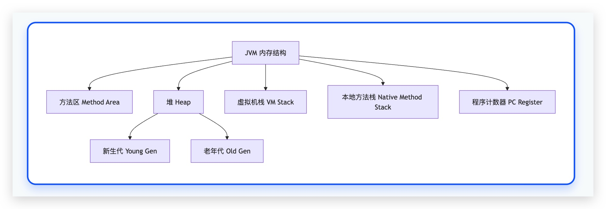

# 熟悉Java核心知识，熟悉常用集合及其数据结构，面向对象等
## 集合：
hashmap：
hashmap就是基于键值对来进行存储的一个数组，存储数据采用哈希表的结构 
当链表长度超过8，当链表长度小于6时转为链表；
数组长度超过64会转换为红黑树来进行存储
hashmap是线程不安全的，多线程情况下，容易出现死循环，导致cpu占用率飙升

扩容： 
触发条件就是键值对超过阈值    
一般阈值是容量乘以负载因子（0.75）这是一个在时间和空间成本上的折衷。                 
目的：
减少哈希冲突：
通过扩大数组容量，使得更加均匀的分布，减少哈希冲突，保证查询效率
保持性能：
不扩容的话，链表和红黑树越来越大，性能会下降

hashset：
基于hashmap来进行实现，存储不重复的键值对，底层是HashMap，
所以存储元素是键，值的话是固定的object

HashMap 的工作原理是什么？
基于哈希表，通过 Key 的 hashCode()计算数组下标存储和获取数据，使用链表和红黑树解决哈希冲突。
JDK 1.8 中 HashMap 做了什么优化？
引入了红黑树，当链表长度超过 8 且数组长度大于等于 64 时，将链表转为红黑树，防止查询性能退化。
HashMap 的扩容机制是怎样的？
当元素数量超过 容量 * 负载因子时，容量变为原来的 2 倍。JDK 1.8 优化了重新计算元素新位置的过程。
为什么 HashMap 的长度是 2 的幂次方？
为了高效计算数组下标。通过 (n-1) & hash代替 hash % n，位运算效率远高于取模运算。同时，这个设计也是 JDK 1.8 高效扩容算法的基础。
HashMap 是线程安全的吗？怎么解决？
不是。使用 ConcurrentHashMap。
HashMap 和 Hashtable 的区别？
HashMap 线程不安全，允许 null 键/值；Hashtable 线程安全（方法用 synchronized 修饰），不允许 null 键/值。Hashtable 已过时。

## 数据结构：
#### 基本数据类型：
整数型：**byte,short,int,long**,
浮点型：**float,double**
字符型：**char**,
布尔型：**boolean**

#### 引用数据类型:
类class,接口interface,数组

# 了解JVM内存区域划分，垃圾回收算法，双亲委派机制
内存划分：
**方法区**：用于存储类的结构信息，java8之后改用元空间
用于存储已被虚拟机加载的类信息、常量、静态变量、即时编译器编译后的代码缓存等数据。

**堆**：用于存储对象实例和数组，是垃圾收集器管理的重点区域
分代：
新生代：
Eden区Survivor区
对象刚创建会被分配到这
Eden区满了之后，触发minor gc，将存活的对象复制到Survivor区，然后清空Eden区

                 老年代：
                        存活时间较长的对象会被复制到老年代
老年代满了之后，触发full gc，对老年代进行垃圾回收

**程序计数器**：
当前线程所执行的字节码的行号指示器。
每个线程私有，用于线程切换后恢复执行时使用。
特点： JVM 中唯一一个不会抛出 OOM 的内存区域。

**虚拟机栈**：
管理java调用的运行状态，每个方法调用对应一个栈帧（局部变量表、操作数栈、方法出口等信息）
每个进程私有，生命周期和线程同步。
异常：
StackOverflowError：线程请求的栈深度大于虚拟机所允许的深度
OutOfMemoryError：虚拟机栈无法申请到足够内存

**本地方法栈**：
为native本地方法服务
结构和虚拟机栈一样，只是为了native方法服务
异常：和虚拟机栈一样

