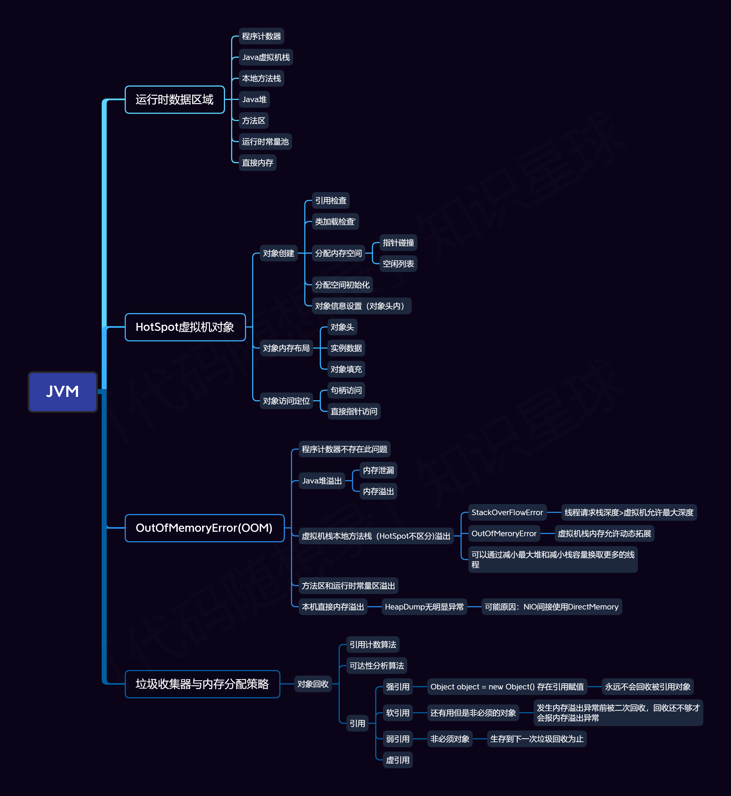
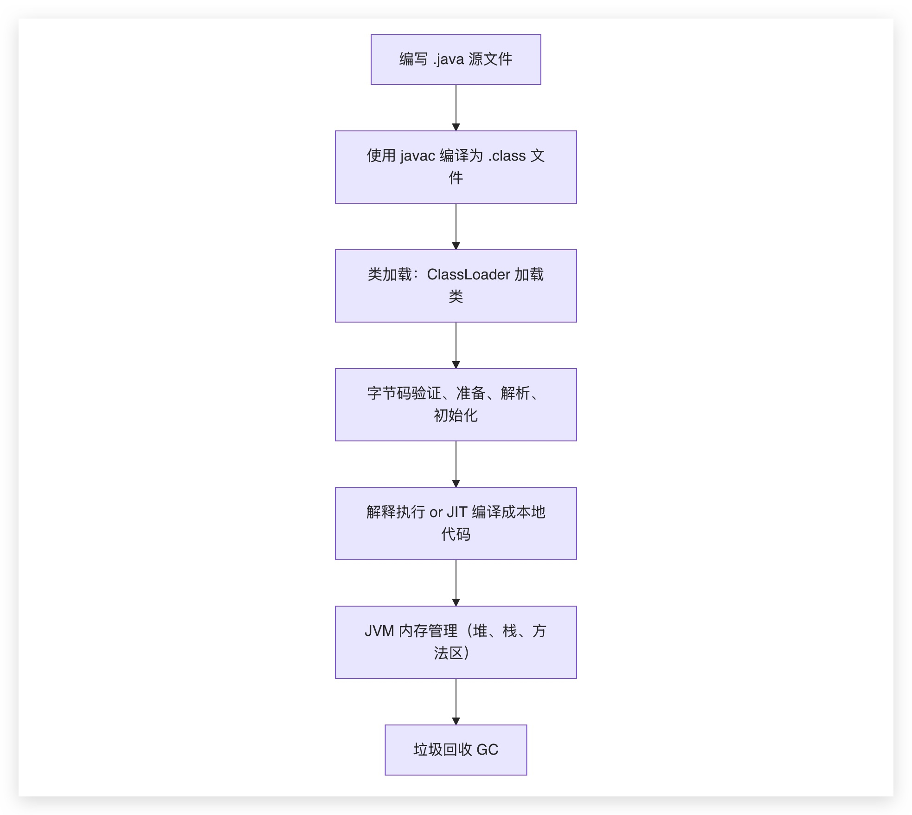
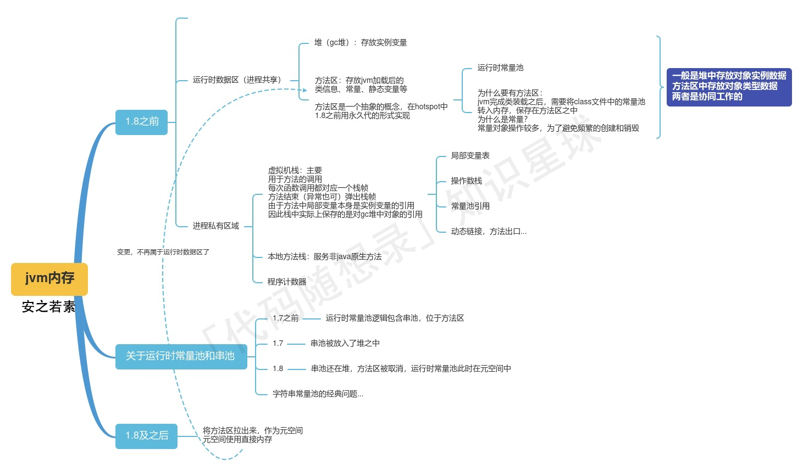

# 1. jvm是什么？在java中是扮演什么角色？
    java虚拟机，java程序运行的环境，是java程序和操作系统之间的一恶搞中间层。
    
    核心任务就是“一次编写，到处运行”

    
     jvm是java技术体系的核心：

**平台无关性/可移植性**：
jvm屏蔽了底层操作系统平台之间的差异，实现了“一次编译，到处运行”。

**内存管理与垃圾回收：**
**内存管理**：使用new创建对象时，jvm会在堆上分配内存空间，
**垃圾回收**：会自动释放不再使用的对象所占用的内存空间。

提供运行时环境：
加载字节码后，为其提供一个完整的执行环境，包括：
编译器
运行时数据区

# 2.java代码是如何被执行的？从编写到运行经历了哪些过程？（java代码执行流程）

首先进行java源代码的编写（.java）
然后javac会对其进行编译，将其编译为字节码（.class）
第三步，类加载，通过类加载器将.class文件加载到内存中
        四，验证，检查合法性
        5，准备，为静态变量分配内存，赋默认值
        6，解析，将符号引用转换为直接引用
        7，初始化，为静态变量赋初始值
5，执行字节码，使用解释器逐条翻译字节码，也可借助jit编译器
6.内存管理
7.垃圾回收

# 3. jvm夸平台是如何实现的（实现机制
一次编写，到处运行

java程序不是直接编译为机器码，而是编译为中间代码--字节码(.class）
这些字节码是各个平台上的jvm来解释或编译执行的

Java 的跨平台性是靠 JVM + 字节码机制 实现的。

# 4.jvm的内存结构包括哪些部分
**方法区**：用于存储类的结构信息，java8之后改用元空间

**堆**：用于存储对象实例和数组，是垃圾收集器管理的重点区域
        分代：
                新生代：
                        Eden区Survivor区
                        对象刚创建会被分配到这
Eden区满了之后，触发minor gc，将存活的对象复制到Survivor区，然后清空Eden区

                 老年代：
                        存活时间较长的对象会被复制到老年代
老年代满了之后，触发full gc，对老年代进行垃圾回收

**程序计数器**：
当前线程所执行的字节码的行号指示器。
每个线程私有，用于线程切换后恢复执行时使用。
特点： JVM 中唯一一个不会抛出 OOM 的内存区域。

**虚拟机栈**：
管理java调用的运行状态，每个方法调用对应一个栈帧（局部变量表、操作数栈、方法出口等信息）
每个进程私有，生命周期和线程同步。
异常：
        StackOverflowError：线程请求的栈深度大于虚拟机所允许的深度
        OutOfMemoryError：虚拟机栈无法申请到足够内存

**本地方法栈**：
为native本地方法服务
结构和虚拟机栈一样，只是为了native方法服务
异常：和虚拟机栈一样

# 5.堆和栈的区别是什么？jvm中它们的作用分别是》（堆和栈的区别和作用）
存储的对象不一样，堆存放所有对象实例和数组，栈存放方法调用过程中的栈帧（局部变量、操作数栈等
生命周期：栈帧在方法调用结束后被销毁，堆中的对象实例和数组会一直存在，直到被垃圾回收
内存大小：栈内存大小由虚拟机决定（较小且固定），堆内存大小由程序员决定
线程共享：栈内存是线程私有的，堆内存是线程共享的

# java中的垃圾回收机制是 如何工作的？有哪些常见的垃圾回收器？（垃圾回收机制和回收器）
        gc机制：
              分代回收理论：
                        java堆中将大对象分为新生代和老年代
                        新生代：存活时间较短的对象
                        老年代：存活时间较长的对象（缓存）
                        永久生代：保存类信息、静态变量、方法信息
新生代中，对象会先分配到Eden区，Eden区满了之后，会触发minor gc，
将存活的对象复制到Survivor区，然后清空Eden区

