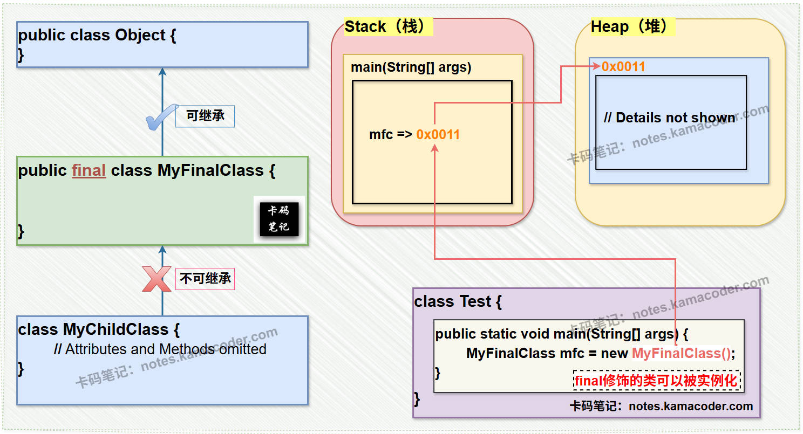

1.java中的数据类型有哪些？分为那两大类？

  就是分为基本数据类型和引用数据类型
基本数据类型：
整数型：**byte,short,int,long**,
浮点型：**float,double**
字符型：**char**,
布尔型：**boolean**

引用数据类型:
类class,接口interface,数组

拓展图，取值范围，默认值

2.java中的final关键字可以修饰什么，修饰了之后有什么特点：
可以来修饰**类，方法，变量**，不能修饰**构造器**
修饰类：该类不能被**继承**

修饰方法：该方法不能被**重写**

修饰变量：该变量不能被**重新赋值**，但是可以改变引用对象的属性值

3.自动装箱于拆箱机制
自动装箱：编译器自动将基本数据类型转换成对应的包装类型
自动拆箱：编译器自动将包装类型转换成对应的基本数据类型

4.java的访问修饰符有哪些？
public，公共
protected，受保护
default，默认
private，私有

5.java中静态变量和非静态的区别？

存储在方法区的静态存储区，在类加载时分配内存
全局共享，所有对象实例共享和静态方法
可以通过**类名.变量名**访问

非静态
存储在堆内存中
随实例创建，随实例销毁
必须通过实例对象访问

6.经典问题重载和重写
重载：
是在同一个类当中，方法名相同，但是参数不同

重写：
是子类重新实现父类方法

7.

